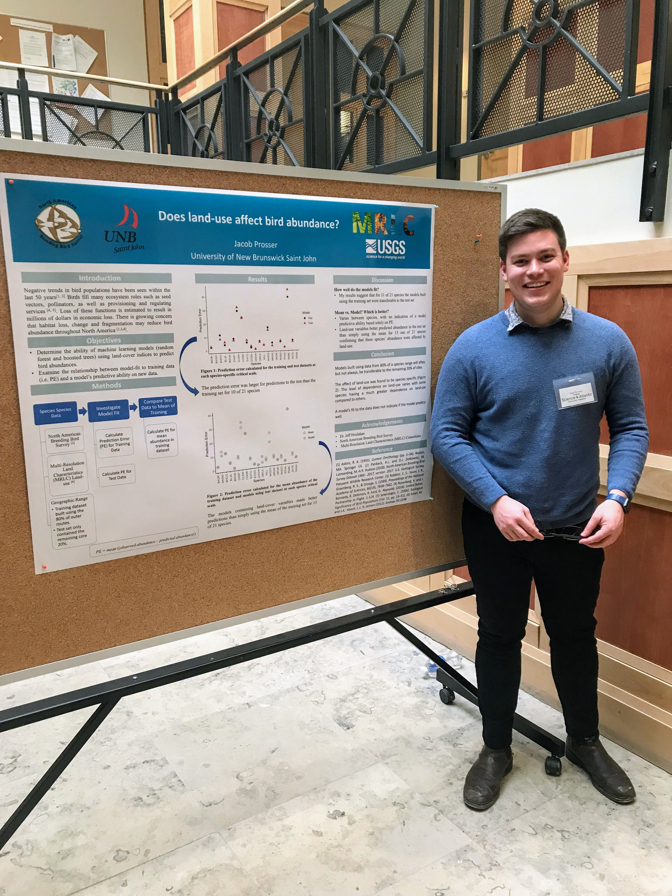
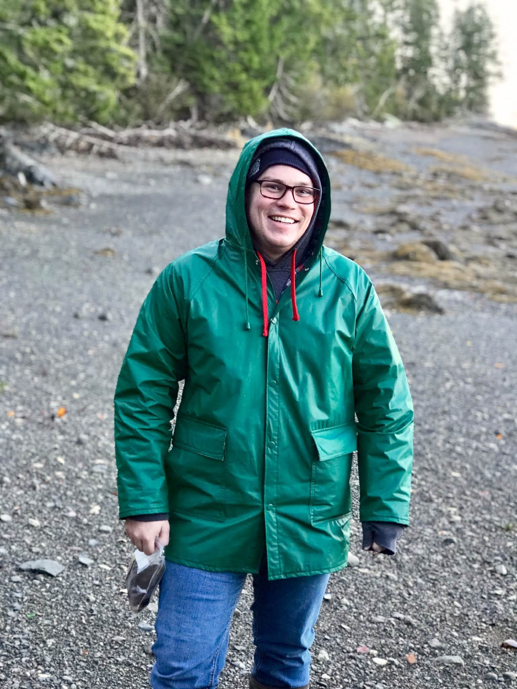

# Background and Schooling {.unnumbered}

I grew up and lived in Moncton, New Brunswick until I moved to Saint John, New Brunswick to attended the [University of New Brunswick](https://www.unb.ca/). Here, I studied Marine Biology and discovered my interest in statistics and mathematics. Realizing this, I applied my time at UNB to understand how a species environmental conditions can be used to make predictions about interactions, abundances and population dynamics. Under the supervisor of Dr. Jeff Houlahan, my undergraduate honours thesis investigated how random forest and boosted tree models could predict bird abundances within the United States of America based on land-use data.

{width="400"}

Through UNB, I was able to participate in the [UNB Marine Semester](https://www.unb.ca/saintjohn/sase/dept/bio-sciences/programs/marine-semester.html). Based at the Huntsman Marine Science Centre (HMSC) in St. Andrews, the Marine Fall Semester is an intensive, 12-week immersion program in a marine setting. It provides students with hands-on study experience of diverse marine organisms, including mammals (whales and seals), algae, fish and invertebrates. Through this program, I investigated how wave and ocean current data could be used to identify sub-populations of dog whelk *Nucella lapillus* and periwinkle *Littorina littorea* within the Bay of Fundy.

{width="400"}

